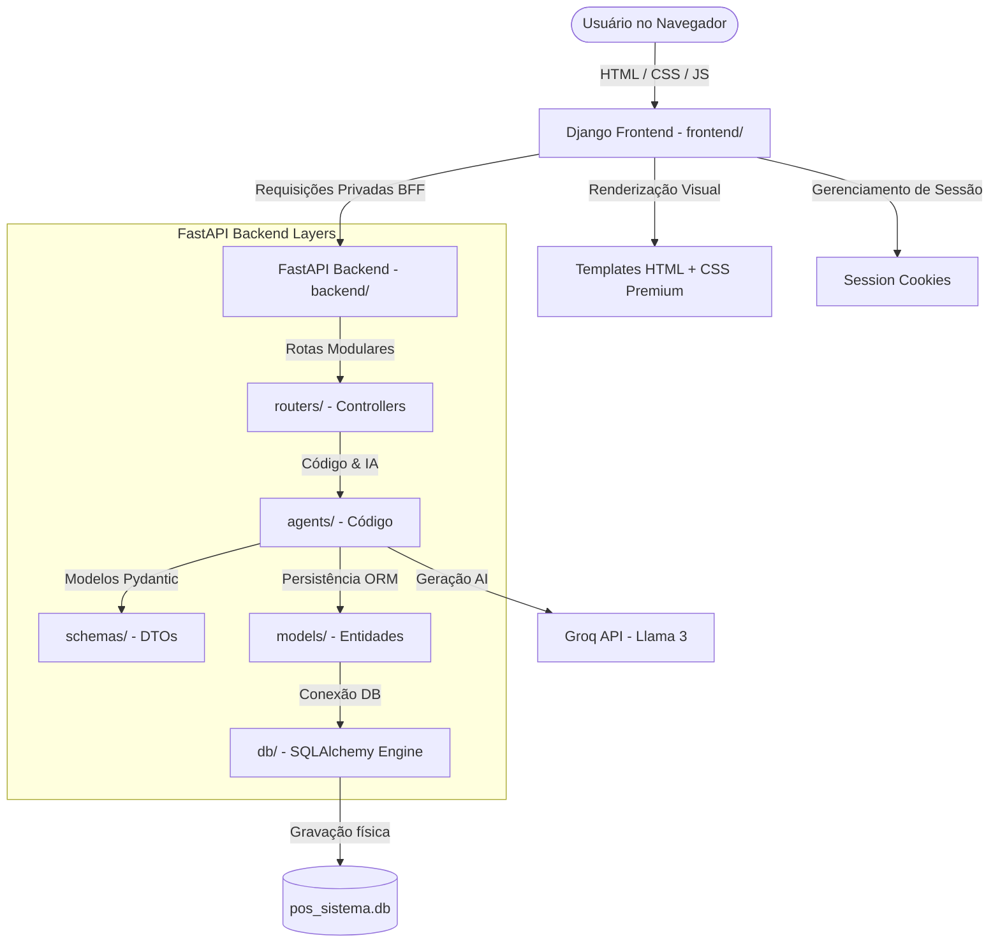

# Especificação Técnica: Arquitetura do Sistema e Estrutura de Camadas (Django + FastAPI)

Este documento descreve a arquitetura geral do sistema híbrido, focando na **separação total em pastas e na modularização em camadas limpas** entre o Front-end (**Django**) e o Back-end (**FastAPI**). Essa estrutura garante manutenibilidade premium, alta escalabilidade e isolamento completo de responsabilidades.

---

## 1. Visão Geral da Arquitetura e Isolamento

O sistema é estritamente separado em dois diretórios independentes sob a raiz do repositório:



### Regras de Isolamento:
1. **Front-end e Back-end Independentes:** O Django e o FastAPI rodam em processos e portas separadas, comunicando-se unicamente via chamadas de rede HTTP RESTful privadas (Server-to-Server / BFF).
2. **Sem Vazamento de Lógica de IA para o Front-end:** Toda a engenharia de prompts, as chamadas para a API do Groq e o processamento de Habilidades do Agente (Agent Skills) residem unicamente no FastAPI. O Django apenas exibe as saídas JSON formatadas de forma visualmente rica.
3. **Sem Vazamento de Banco de Dados para a Interface:** O Django nunca acessa o banco de dados do FastAPI diretamente. Toda manipulação de dados é feita consumindo os endpoints REST do FastAPI protegidos por tokens de acesso.

---

## 2. Estrutura Detalhada de Pastas e Camadas

Para suportar o crescimento seguro do projeto de forma que a manutenção seja simples, a estrutura física do repositório está organizada exatamente como segue:

```text
django_fastapi/                         # Workspace Root
│
├── backend/                            # CAMADA 2: MOTOR DE APIS E IA BACK-END (FastAPI)
│   ├── main.py                         # Ponto de entrada e inicialização do FastAPI
│   ├── database.py                     # Camada de compatibilidade
│   ├── pos_sistema.db                  # Banco de dados físico SQLite (gerado automaticamente)
│   ├── requirements.txt                # Dependências do back-end
│   ├── pyproject.toml                  # Configurações do uv
│   ├── uv.lock                         # Lockfile do uv
│   ├── .env.example                    # Exemplo de configuração de variáveis de ambiente
│   │
│   ├── core/                           # Configurações Globais & Segurança
│   │   ├── config.py                   # Leitura de variáveis de ambiente (.env)
│   │   └── security.py                 # Funções de hashing (bcrypt) e assinatura JWT
│   │
│   ├── db/                             # Banco de Dados & Conexão
│   │   ├── connection.py               # SQLAlchemy Engine e SessionLocal síncrono
│   │   └── dependency.py               # Injeção de dependência get_db()
│   │
│   ├── models/                         # Entidades de Banco de Dados (ORM)
│   │   ├── base.py                     # Declarative Base compartilhada do SQLAlchemy
│   │   ├── usuario.py                  # Tabela 'usuarios'
│   │   ├── token.py                    # Tabela 'tokens_acesso'
│   │   └── historico.py                # Tabela 'historico_agentes'
│   │
│   ├── schemas/                        # Schemas Pydantic (Validação de Entrada/Saída)
│   │   ├── usuario.py                  # Schemas de criação e retorno de usuários
│   │   ├── token.py                    # Schemas de validação de tokens
│   │   ├── math.py                     # Schemas de números e resultados matemáticos
│   │   └── agent.py                    # Schemas das Agent Skills (Histórias, Aulas)
│   │
│   └── routers/                        # Endpoints da API RESTful (Controllers)
│       ├── auth.py                     # Rotas de Login e Autenticação
│       ├── math.py                     # Rotas de operações matemáticas herdadas
│       └── skills.py                   # Rotas de acionamento das Agent Skills
│
├── .agents/                            # Diretório Centralizado dos Agentes Autônomos (Metadata & Prompts)
│   └── skills/                         # Pasta das 15 Habilidades (contém SKILL.md de cada agente)
│
├── agents/                             # Camada de Código Executável dos Agentes (LLMs & Groq Engine)
│   ├── base.py                         # Instanciação centralizada do cliente Groq
│   ├── storyteller.py                  # Geração de Histórias com Llama 3
│   ├── contract_extractor.py           # Extrator Inteligente de Contratos
│   └── lecture_extractor.py            # Processador Técnico de Aulas (Padrão T-E-C)
│
├── frontend/                           # CAMADA 1: PORTAL WEB FRONT-END (Django)
│   ├── manage.py                       # Utilitário de execução do Django
│   ├── core/                           # Configurações globais do projeto Django
│   ├── accounts/                       # App de Login, Registro e Autenticação
│   ├── portal/                         # App de Dashboard e painéis das Agent Skills
│   ├── templates/                      # Interface visual (HTML dinâmico modernizado)
│   └── static/                         # Estilos (Vanilla CSS premium), Scripts e Imagens
│
├── spec/                               # Documentação e Planejamento Técnico
│   ├── 01_arquitetura.md               # [Esta Especificação]
│   ├── 02_banco_de_dados_usuarios.md
│   ├── 03_agent_skills.md
│   ├── 04_plano_de_implementacao.md
│   ├── 05_esquema_banco_dados.md
│   ├── 06_rotas_crud_api.md
│   └── frontend.md                     # Especificação do Portal Frontend
│
├── .venv/                              # Ambiente virtual compartilhado
└── run_servers.ps1                     # Script de inicialização automática de ambos os servidores
```

---

## 3. Descrição Detalhada das Responsabilidades das Camadas do FastAPI

### A. A Camada de Rotas (`routers/`)
* **Responsabilidade:** Receber requisições HTTP, mapear parâmetros (de rota, query ou corpo) e retornar respostas formatadas.
* **Isolamento:** Não contém lógica de banco de dados direta (CRUD) nem lógica de prompts da IA. Apenas recebe os schemas Pydantic, injeta as dependências de banco de dados (`get_db`) e delega o processamento pesado para as **Agent Skills** ou serviços.

### B. A Camada de Agentes (`.agents/` & `agents/`)
* **Responsabilidade:** Concentrar toda a inteligência do sistema. É dividida em duas subcamadas:
  1. **`.agents/skills/` (Instruções e Metadados):** Contém a documentação e os prompts de comportamento de cada uma das 15 Habilidades de Agente (ex: `SKILL.md` de cada pasta de agente).
  2. **`agents/` (Código Executável):** Implementa as funções Python de invocação da LLM (Groq) utilizando o modelo `llama-3.1-8b-instant` otimizado para alta velocidade.
* **Isolamento:** Completamente independente do FastAPI e das rotas. Suas funções recebem e retornam objetos Python/Pydantic puros, tornando-as extremamente fáceis de testar e escalar.

### C. A Camada de Schemas (`schemas/`)
* **Responsabilidade:** Validação sintática e estrita de tipos de dados. Funciona como DTO (Data Transfer Objects).
* **Isolamento:** Contém apenas classes Pydantic, garantindo que os dados que entram ou saem da API estejam exatamente no formato especificado antes de qualquer processamento de negócio.

### D. A Camada de Modelos (`models/`)
* **Responsabilidade:** Definir o mapeamento das tabelas relacionais do SQLAlchemy que serão traduzidas para o SQLite físico.
* **Isolamento:** Contém unicamente as entidades do ORM SQLAlchemy. Ela não faz validação HTTP nem lógica de IA.

### E. A Camada de Banco de Dados (`db/`)
* **Responsabilidade:** Gerenciar a conexão e o ciclo de vida das transações através da injeção de dependência síncrona `get_db()`.
* **Isolamento:** Fornece a sessão ativa do banco para as rotas que necessitam gravar dados, garantindo que a sessão seja fechada de forma segura ao final de cada requisição.

---

## 4. Benefícios Práticos para Manutenção

Ao adotar essa estrutura dividida em pastas e camadas:
* **Fácil depuração:** Se houver um ajuste de comportamento ou prompt de IA, ele é feito de forma declarativa e documentado no `SKILL.md` em `.agents/skills/` e implementado programaticamente em `agents/`. Se houver uma falha de banco de dados, está restrita a `models/`.
* **Crescimento Sustentável:** Se quisermos adicionar um novo agente inteligente (ex: assistente de dúvidas), basta criarmos uma nova pasta em `.agents/skills/` com seu `SKILL.md` correspondente para espelhar as informações e criarmos a função executável correspondente em `agents/` sem alterar os agentes existentes.
