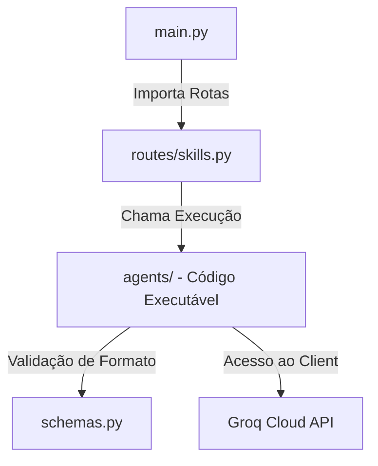

# Especificação Técnica: Agent Skills (Habilidades de Agente & Baseline)

Este documento especifica a linha de base (baseline) atual da nossa aplicação, detalhando os endpoints existentes no arquivo `main.py` (incluindo operações matemáticas, segurança por token, e a integração com a API do Groq), bem como o design arquitetural para as futuras **Agent Skills** (Habilidades de Agente AI).

---

## 1. Linha de Base Atual (`main.py`)

A aplicação atual é executada localmente utilizando o servidor web assíncrono **Uvicorn** (`uvicorn main:app --reload`) sob a porta `8000`. Ela expõe recursos matemáticos básicos de validação e a primeira versão de habilidade geradora de histórias integrada ao modelo **Llama 3** via biblioteca **Groq**.

### A. Metadados e Dependência Global de Segurança
A API está registrada sob a seguinte assinatura de segurança global:
* **Título da API:** "Aula"
* **Dependência de Segurança:** `Depends(common_api_token)`
* **Token Fixo:** `API_TOKEN = "123"`

#### Fluxo de Segurança:
Qualquer requisição feita à API é interceptada pelo método `common_api_token(api_token: str)`, que realiza o log do token recebido e valida se ele é igual a `"123"`. Caso seja inválido, uma exceção `HTTPException` com status `401 Unauthorized` é retornada.

---

### B. Endpoints de Baseline Implementados

#### 1. `GET /` e `GET /status`
* **Descrição:** Verificam a saúde da API e o status de funcionamento online do servidor.
* **Saída `/`:** `{"message": "Servidor FastAPI rodando com sucesso!"}`
* **Saída `/status`:** `{"status": "online"}`

#### 2. Operações Matemáticas (Soma)
O sistema expõe três versões da operação de soma, demonstrando o uso de parâmetros de rota, parâmetros de query e corpos de requisição estruturados.

* **`GET /soma/v1/{numero1}/{numero2}`**
  * **Tags:** Operações matemáticas.
  * **Parâmetros:** Recebe dois inteiros como parâmetros de rota (`numero1` e `numero2`).
  * **Validação:** Se a soma total for menor que `0`, retorna uma exceção `400 Bad Request` com o detalhe `"Resultado negativo"`.
  
* **`POST /soma/v2` (Descontinuado - Deprecado)**
  * **Tags:** Operações matemáticas.
  * **Parâmetros:** Recebe `numero1`, `numero2` e `api_token` via query string.
  
* **`POST /soma/v3`**
  * **Tags:** Operações matemáticas.
  * **Corpo (Pydantic Model `Numeros`):**
    ```json
    {
      "numero1": 5,
      "numero2": 3
    }
    ```
  * **Validação:** Se qualquer um dos números for negativo, retorna uma exceção `400 Bad Request` informando `"Números devem ser positivos"`.
  * **Saída (Pydantic Model `Resultado`):** `{"resultado": <total>}`

* **`POST /operacao_matematica`**
  * **Tags:** Operações matemáticas.
  * **Parâmetros:** Recebe o corpo `Numeros` e um parâmetro de query enumerado `TipoOperacao` (`soma`, `subtracao`, `multiplicacao`, `divisao`).
  * **Saída:** Retorna o cálculo exato com base na operação escolhida.

---

### C. Integração Atual com a API do Groq (Geração de Histórias)

A primeira Habilidade de Agente funcional está integrada diretamente no arquivo de entrada:

* **Endpoint:** `POST /gerar_historia`
* **Corpo da Requisição (Pydantic Model `Historia`):**
  ```python
  class Historia(BaseModel):
      Tema: str = Field(..., description="Tema da história")
  ```
* **Cliente de Conexão:** Instanciado via `Groq(api_key=os.getenv("GROQ_API_KEY"))`.
* **Configuração de Execução de IA:**
  * **Modelo Utilizado:** `llama-3.1-8b-instant` (modelo de latência ultra-baixa).
  * **Prompt Dinâmico:** `"Escreva uma história sobre o tema: {historia.Tema}"`
  * **Resposta:** Retorna o conteúdo Markdown puro gerado pela IA no formato `{"historia": "<texto_gerado>"}`.

---

## 2. Padrão de Modularização das Agent Skills

Como o arquivo `main.py` atual abriga toda a lógica descrita acima, a especificação técnica para as **novas Agent Skills** exige que façamos uma separação modular limpa quando iniciarmos a fase de codificação:



### O Padrão T-E-C (Teoria - Exemplo - Código)
Para novas habilidades técnicas planejadas (como o processamento de materiais didáticos e aulas de programação):
1. **Teoria (Theory):** O agente deve expor a fundamentação teórica de forma clara e rigorosa.
2. **Exemplo (Example):** Aplicação visual do conceito, analogias do dia a dia.
3. **Código (Code):** Exemplo funcional de código-fonte completo, amplamente comentado linha por linha.

---

## 3. Estrutura e Especificação das Habilidades (`.agents/skills/` & `agents/`)

Para manter o seu código limpo e permitir o crescimento das habilidades, documentamos as instruções de comportamento e prompts estruturados em formato Markdown dentro de `.agents/skills/[nome-agente]/SKILL.md` e isolamos as lógicas Python de prompt em funções dedicadas no arquivo `agents/` (ex: `storyteller.py`, `lecture_extractor.py`, `contract_extractor.py`) utilizando o Groq:

```python
# agents/storyteller.py
from groq import Groq
import os
from pydantic import BaseModel, Field

# Inicialização centralizada do cliente Groq
client = Groq(api_key=os.getenv("GROQ_API_KEY"))

# --- 1. SKILL: Gerador de Histórias (Refatorado) ---
class HistoriaInput(BaseModel):
    tema: str = Field(..., description="Tema da história a ser gerada")

class HistoriaOutput(BaseModel):
    tema: str
    historia: str

def skill_gerar_historia(data: HistoriaInput) -> HistoriaOutput:
    prompt = f"Escreva uma história sobre o tema: {data.tema}"
    
    chat_completion = client.chat.completions.create(
        messages=[
            {
                "role": "user",
                "content": prompt,
            }
        ],
        model="llama-3.1-8b-instant",
    )
    
    conteudo = chat_completion.choices[0].message.content
    return HistoriaOutput(tema=data.tema, historia=conteudo)


# --- 2. SKILL: Extrator Técnico de Aulas (Padrão T-E-C) ---
class AulaInput(BaseModel):
    transcricao: str = Field(..., description="Transcrição bruta da aula")

class SecaoTEC(BaseModel):
    teoria: str = Field(..., description="Fundamentação teórica explicativa")
    exemplo: str = Field(..., description="Analogia prática e cenário real")
    codigo: str = Field(..., description="Código prático, limpo e comentado")

class AulaOutput(BaseModel):
    titulo: str
    secoes: list[SecaoTEC]
```

Dessa forma, o seu `main.py` ficará leve, mantendo os endpoints de operações matemáticas que você já desenvolveu e integrando a persistência no banco de dados MySQL ou PostgreSQL sem misturar responsabilidades.
