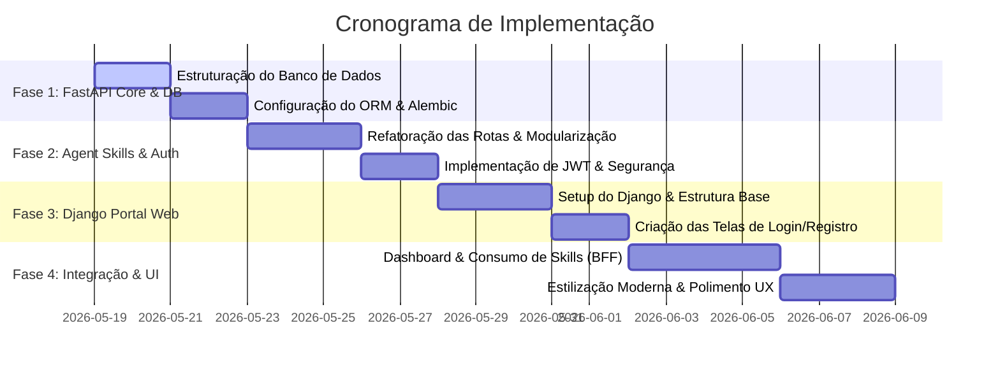

# Plano de Implementação Técnica (Roadmap)

Este documento estabelece o cronograma ordenado de desenvolvimento do sistema híbrido Django + FastAPI, dividindo o escopo em fases claras e incrementais. Nosso foco é garantir que cada parte seja testada e validada de forma independente antes de avançarmos para as integrações visuais.

---

## 1. Visão Geral das Fases

---

## 2. Detalhamento de Cada Fase

### Fase 1: Infraestrutura do Back-end & Banco de Dados (FastAPI)
* **Objetivo:** Estabelecer a conexão persistente e a estrutura de tabelas.
* **Tarefas:**
  1. Instalar as dependências adicionais no FastAPI: `uv add sqlalchemy alembic passlib[bcrypt] pyjwt`.
  2. Criar `database.py` para gerenciar a pool de conexões e a sessão do banco de dados (inicialmente com SQLite, preparado para PostgreSQL).
  3. Criar `models.py` contendo as classes SQLAlchemy para `Usuario`, `TokenAcesso` e `HistoricoAgente`.
  4. Configurar o **Alembic** e rodar a primeira migração para criar as tabelas no banco de dados local.
  5. Validar a criação do banco de dados inspecionando o arquivo de banco ou executando scripts de teste rápidos.

### Fase 2: Modularização, Segurança & Agent Skills (FastAPI)
* **Objetivo:** Refatorar a aplicação FastAPI existente para torná-la profissional e implementar as primeiras habilidades de agente autônomas.
* **Tarefas:**
  1. Separar o arquivo `main.py` em subpastas ou arquivos modulares:
     * `schemas.py`: Para validações Pydantic.
     * `agents/`: Para isolar as chamadas ao Groq (Storyteller, Extratores) e `.agents/skills/` para as especificações das 15 habilidades.
     * `routes/`: Pasta contendo rotas organizadas por domínio (auth, skills, users).
  2. Implementar fluxo de registro de usuário com senha criptografada (`bcrypt`).
  3. Adicionar middleware ou dependência de autenticação que valida tokens JWT nos cabeçalhos de requisição.
  4. Implementar a Skill **`extrator_tecnico_aula`** com o padrão T-E-C no arquivo de habilidades e criar sua respectiva rota no FastAPI.
  5. Testar os endpoints interativamente usando o Swagger UI (`http://127.0.0.1:8000/docs`).

### Fase 3: Estrutura Base do Front-end (Django)
* **Objetivo:** Iniciar o projeto Django que servirá como portal de acesso dos usuários finais.
* **Tarefas:**
  1. Inicializar o projeto Django na pasta correspondente `pos_django_front` (utilizando `django-admin startproject`).
  2. Configurar o app de gerenciamento de contas (`accounts`) com telas modernas de Login, Cadastro de Usuário e Recuperação de Senha.
  3. Definir a folha de estilos base do projeto (`static/css/styles.css`) usando Vanilla CSS premium (moderno, com gradientes elegantes, glassmorphism e micro-animações) para proporcionar uma experiência visual primorosa.
  4. Garantir que as rotas básicas do Django estejam protegidas e redirecionem o usuário não autenticado de volta à tela de login.

### Fase 4: Integração de Sistemas & Experiência do Usuário (BFF)
* **Objetivo:** Fazer o Django consumir as APIs e Habilidades do FastAPI e exibir os dados de forma encantadora.
* **Tarefas:**
  1. Implementar o cliente HTTP no Django utilizando a biblioteca assíncrona `httpx` para fazer chamadas diretas ao FastAPI.
  2. Ao logar no Django, o sistema faz o login por baixo dos panos no FastAPI, obtém o token JWT e o armazena de forma segura na sessão do Django.
  3. Criar a tela do **Dashboard Principal** no Django:
     * Exibição das Habilidades de IA disponíveis como "cards" interativos de alta qualidade visual.
     * Histórico de execuções passadas do usuário (dados obtidos via FastAPI).
  4. Criar a interface interativa para execução das Skills de IA (ex: Painel do Storyteller e Painel do Extrator de Aulas):
     * Input intuitivo para digitação do tema ou upload/colagem da transcrição de aula.
     * Efeito visual elegante de "Carregando" (Skeleton Screens ou Spinners premium) enquanto a IA processa o prompt.
     * Exibição do resultado estilizado e bem-formatado na tela (utilizando blocos de código com destaque de sintaxe, tabelas e markdown limpo).

---

## 3. Critérios de Sucesso e Validação

Para cada fase concluída, os seguintes itens devem ser validados:
1. **Segurança:** Nenhum token ou credencial é exposto no código fonte ou na URL do navegador.
2. **Desempenho:** Respostas rápidas e assíncronas no FastAPI; carregamentos otimizados no Django.
3. **Fidelidade Visual:** A interface deve causar um impacto positivo imediato no usuário (visual de alta fidelidade, limpo, responsivo e interativo).
4. **Resiliência:** Se a API do Groq ou o banco de dados falharem, o sistema deve apresentar uma mensagem de erro amigável ao usuário sem interromper a execução do servidor.
