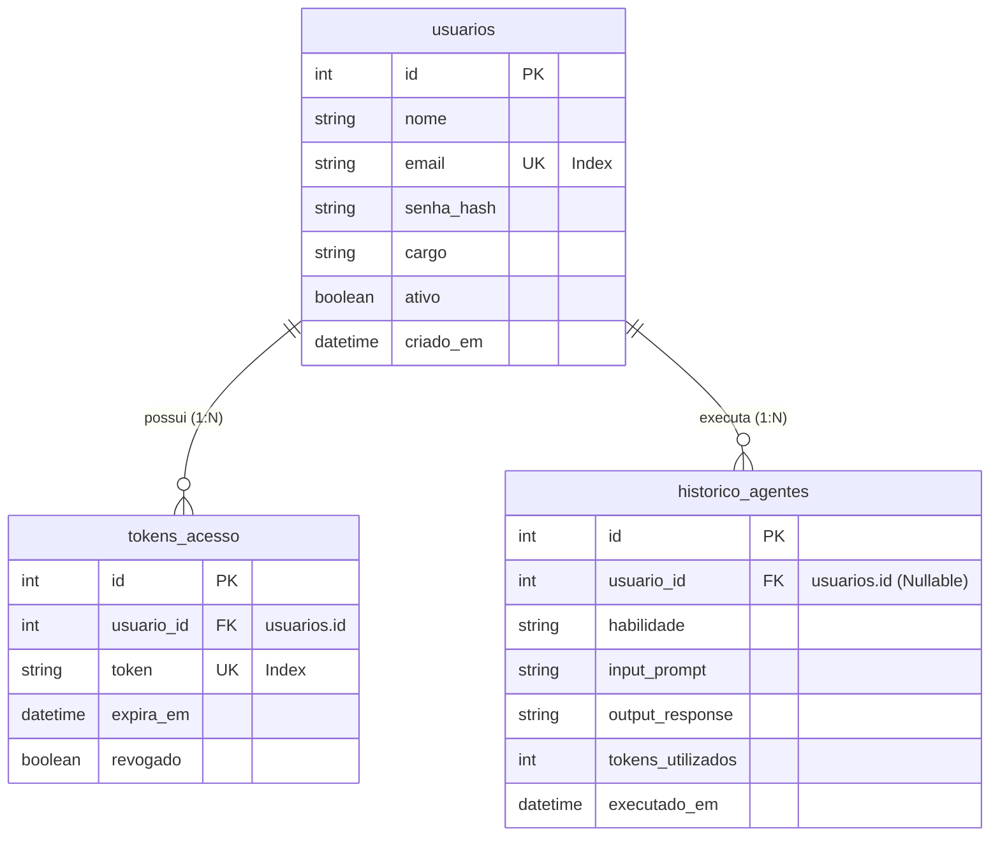

# Especificação Técnica: Dicionário de Dados e Tabelas do Banco de Dados

Este documento é a especificação isolada e o **dicionário de dados vivo** do nosso banco de dados relacional. Ele mapeia fisicamente cada tabela, seus campos, tipos de dados, restrições e relacionamentos para garantir a integridade referencial do sistema. 

À medida que o sistema crescer, novos campos e tabelas serão descritos e documentados incrementalmente aqui antes de sua implementação física.

---

## 1. Diagrama de Relacionamento de Dados (ERD)

O diagrama a seguir exibe como as tabelas atuais de usuários, tokens de acesso e logs se comunicam e se relacionam através de chaves estrangeiras:

---

## 2. Detalhamento Físico das Tabelas (Dicionário de Dados)

### A. Tabela: `usuarios`
* **Nome Físico no Banco:** `usuarios`
* **Objetivo:** Armazena o cadastro básico e as credenciais de autenticação de todos os usuários do sistema.

| Campo Físico | Tipo de Dados SQL | Restrições | Padrão (Default) | Descrição |
| :--- | :--- | :--- | :--- | :--- |
| `id` | `INTEGER` | PRIMARY KEY, AUTOINCREMENT | *Nenhum* | Identificador numérico e sequencial único do usuário. |
| `nome` | `VARCHAR(100)` | NOT NULL | *Nenhum* | Nome completo ou de exibição do usuário. |
| `email` | `VARCHAR(100)` | NOT NULL, UNIQUE, INDEX | *Nenhum* | Endereço de email do usuário (utilizado para o Login). |
| `senha_hash` | `VARCHAR(255)` | NOT NULL | *Nenhum* | Hash criptografado da senha gerado com algoritmo `bcrypt`. |
| `cargo` | `VARCHAR(20)` | NOT NULL | `'user'` | Nível de acesso ou cargo do usuário (`admin`, `user`, `manager`). |
| `ativo` | `BOOLEAN` | NOT NULL | `True` | Flag que controla o bloqueio ou ativação da conta. |
| `criado_em` | `DATETIME` | NOT NULL | `CURRENT_TIMESTAMP` | Data e hora em que o registro foi inserido no banco. |

---

### B. Tabela: `tokens_acesso`
* **Nome Físico no Banco:** `tokens_acesso`
* **Objetivo:** Controla as sessões seguras e os tokens ativos (JWT ou UUID) vinculados a cada usuário autenticado.

| Campo Físico | Tipo de Dados SQL | Restrições | Padrão (Default) | Descrição |
| :--- | :--- | :--- | :--- | :--- |
| `id` | `INTEGER` | PRIMARY KEY, AUTOINCREMENT | *Nenhum* | Identificador sequencial único do token. |
| `usuario_id` | `INTEGER` | FOREIGN KEY, NOT NULL | *Nenhum* | ID do usuário a quem este token pertence (referencia `usuarios.id`). |
| `token` | `VARCHAR(255)` | NOT NULL, UNIQUE, INDEX | *Nenhum* | Valor do token criptografado ou string única gerada para sessão. |
| `expira_em` | `DATETIME` | NOT NULL | *Nenhum* | Data e hora exatas de expiração do token. |
| `revogado` | `BOOLEAN` | NOT NULL | `False` | Controla o logout remoto (se `True`, o token foi invalidado antes de expirar). |

---

### C. Tabela: `historico_agentes`
* **Nome Físico no Banco:** `historico_agentes`
* **Objetivo:** Mantém um histórico detalhado e rastreável de todas as execuções de Inteligência Artificial acionadas pelas Agent Skills.

| Campo Físico | Tipo de Dados SQL | Restrições | Padrão (Default) | Descrição |
| :--- | :--- | :--- | :--- | :--- |
| `id` | `INTEGER` | PRIMARY KEY, AUTOINCREMENT | *Nenhum* | Identificador sequencial único do registro de histórico. |
| `usuario_id` | `INTEGER` | FOREIGN KEY, NULLABLE | *Nenhum* | ID do usuário que fez a chamada (referencia `usuarios.id`). Pode ser Nulo. |
| `habilidade` | `VARCHAR(50)` | NOT NULL | *Nenhum* | Nome identificador do agente acionado (ex: `storyteller`, `tec_lecture`). |
| `input_prompt` | `TEXT` | NOT NULL | *Nenhum* | O prompt bruto ou estruturado de entrada enviado para a IA. |
| `output_response` | `TEXT` | NOT NULL | *Nenhum* | A resposta literal (geralmente Markdown) retornada pelo modelo. |
| `tokens_utilizados`| `INTEGER` | NULLABLE | *Nenhum* | Quantidade total de tokens consumidos na API do Groq (Prompt + Completion). |
| `executado_em` | `DATETIME` | NOT NULL | `CURRENT_TIMESTAMP` | Data e hora da chamada efetuada ao serviço de IA. |

---

## 3. Integridade Referencial e Regras de Negócio

Para evitar inconsistências ou dados órfãos no banco de dados, estabelecemos as seguintes políticas físicas:

1. **Associação de Tokens (`usuarios` 1:N `tokens_acesso`):**
   * **Cascateamento:** Se um usuário for excluído permanentemente da tabela `usuarios`, todos os registros correspondentes de seus tokens na tabela `tokens_acesso` serão **removidos automaticamente** (`ON DELETE CASCADE`), garantindo que não restem tokens órfãos.
   
2. **Histórico de Logs (`usuarios` 1:N `historico_agentes`):**
   * **Políticas de Exclusão:** Se um usuário for excluído, seu histórico de IA na tabela `historico_agentes` deve ser preservado para fins de faturamento e logs de auditoria. Para isso, o campo `usuario_id` na tabela de histórico aceita valores nulos, sendo configurado como `NULL` em caso de exclusão (`ON DELETE SET NULL`).
